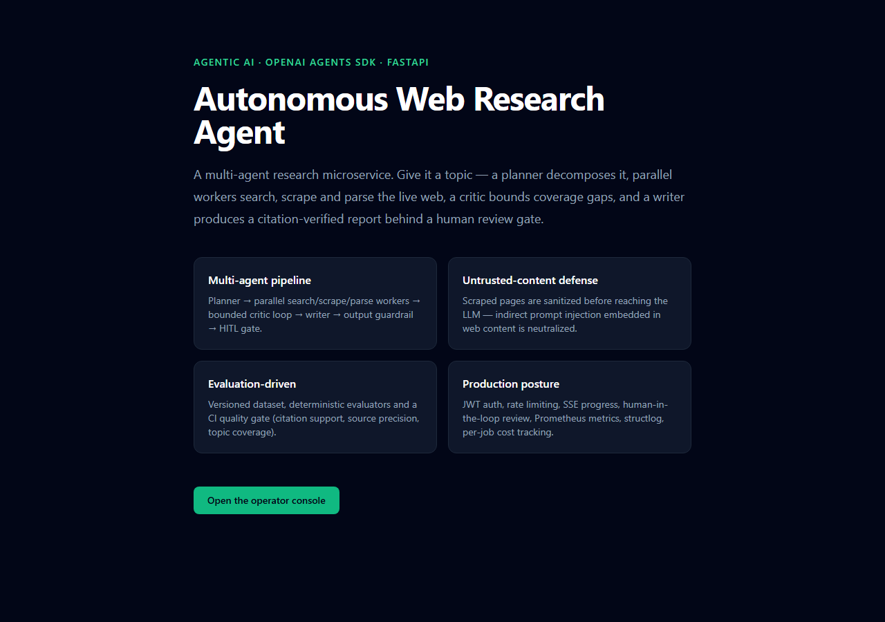
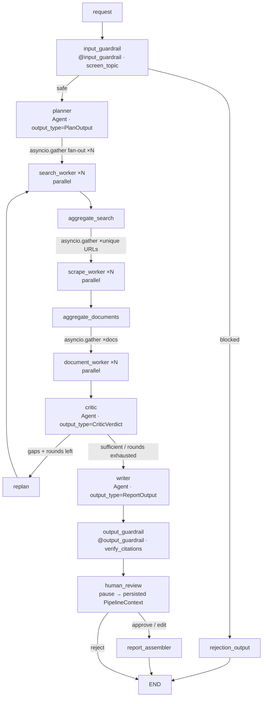
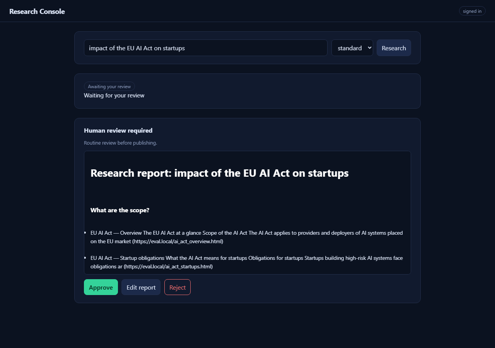
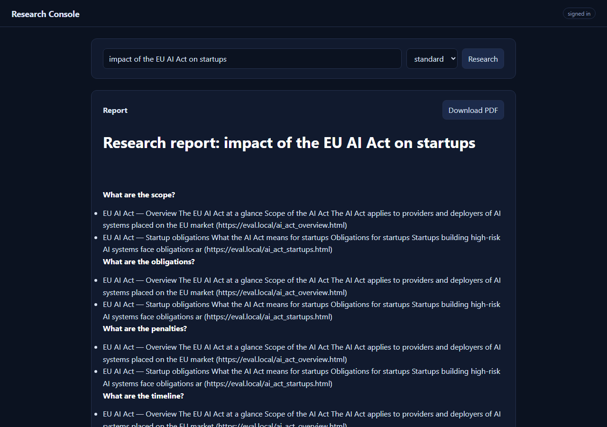

<div align="center">

# 🔁 Autonomous Web Research Agent — OpenAI Agents SDK port

**The same production-shaped research agent — planner → parallel workers → critic → writer — reimplemented on the OpenAI Agents SDK, with the same EDD scorecard, so both frameworks can be compared metric-for-metric.**

[](https://www.python.org/)
[](https://fastapi.tiangolo.com/)
[](https://openai.github.io/openai-agents-python/)
[](https://github.com/kanderson-ai-dev/research-agent-sdk-port/actions/workflows/ci.yml)
[](https://github.com/kanderson-ai-dev/research-agent-sdk-port/actions/workflows/ci.yml)
[](https://github.com/astral-sh/ruff)
[](https://mypy-lang.org/)
[](LICENSE)



</div>

---

## 📌 What this is

A **full-fidelity port** of the
[Autonomous Web Research Agent](https://github.com/kanderson-ai-dev/agentic-web-researcher)
from LangGraph to the **OpenAI Agents SDK** (`openai-agents`). Give it a
topic — it decomposes the problem, searches and scrapes the live web in
parallel, verifies every citation against the fetched evidence, escalates to
a human when coverage is insufficient, and returns a defensible report over
an async job API with live progress streaming.

This is not a rewrite for its own sake — it is a **controlled experiment**.
Same use case, same API contract, same frontend, same guardrails, same
versioned evaluation dataset — so the README can compare LangGraph and the
Agents SDK objectively, with measured numbers instead of vibes.

---

## 💡 Why this matters — for your project, or for a technical reviewer

- 🧪 **A controlled framework comparison, not a demo.** Identical requests,
  identical guardrails, identical SSE stage vocabulary, identical scorecard
  thresholds — the only variable is the agentic runtime.
- 🛡️ **SDK-native guardrails.** The topic screen runs as a real
  `@input_guardrail` on the planner (`run_in_parallel=False` — the SDK
  default would fire the model call concurrently, defeating
  guardrail-first). Citation verification is an `@output_guardrail` on the
  writer that filters, not just blocks.
- 🔁 **Bounded autonomy, same contract.** The critic/re-plan loop is capped
  by `MAX_CRITIC_ROUNDS`; guaranteed termination is proven by a dedicated
  test, exactly like the LangGraph version.
- 🧑‍⚖️ **Honest HITL without a checkpointer.** The SDK has no
  `interrupt()`+checkpoint equivalent — the run pauses at
  `awaiting_review`, the serializable `PipelineContext` is persisted, and
  the review endpoint resumes it (`approve`/`edit`/`reject`).
- ✅ **Citations are verified, not trusted.** Every quote must be present in
  its source's extracted text (verbatim, punctuation-insensitive, or ≥0.85
  sliding-window similarity) or it is dropped and counted.
- 💰 **Per-job cost accounting** via a context-scoped `UsageTracker` fed by
  `RunResult` usage — same metric, different telemetry source.
- 🧪 **CI green with zero secrets.** 147 tests, 92% coverage on `app/`,
  `mypy --strict`, offline EDD scorecard — a custom `StubModel` implementing
  the SDK's `Model` interface makes the whole pipeline deterministic.

---

## 🏗️ Architecture



The orchestrator (`app/pipeline/runner.py`) plays the role LangGraph's
`StateGraph` played: stage sequencing, fan-out, bounded loops, and the
review gate — while the LLM-driven roles are declarative `Agent`s with
`output_type` contracts.

### Two frontend surfaces

| Route | Surface |
|---|---|
| `/` | Minimalist public landing (Tailwind via CDN, no build step). |
| `/console` | Operator console — topic submission, live SSE progress, source list, final report with clickable citations, HITL review modal. |

The frontend is byte-for-byte the original's (only branding strings changed)
— the same console drives both frameworks, which is the point of the
comparison. The captures below are from this repo's deterministic offline
run (`scripts/capture_screenshots.py`, zero network):




---

## ⚖️ LangGraph vs OpenAI Agents SDK — what the port actually showed

Measured side by side on the same dataset, corpus, evaluators and
thresholds (`docs/evaluation-comparison.md` has the full breakdown):

| Dimension | LangGraph (`agentic-web-researcher`) | OpenAI Agents SDK (this port) |
|---|---|---|
| Citation support rate (≥ 0.90) | **1.000** | **1.000** |
| Source precision (≥ 0.80) | **1.000** | **1.000** |
| Topic coverage (≥ 0.85) | **1.000** | **1.000** |
| Citations kept (eu-ai-act / remote-work) | 8 / 3 | 8 / 3 |
| Test suite / coverage | 143 tests · 93% | 147 tests · 92% |

Real trade-offs found while porting — not generic ones:

- **Fan-out**: LangGraph `Send()` is declarative and checkpoint-aware; the
  SDK has no equivalent — the runner owns `asyncio.gather` + explicit merges.
  Same behavior, but scheduling/error-isolation code lives in your code.
- **HITL**: `interrupt()` + `AsyncSqliteSaver` gives resumable graph state
  for free; here a serialized `PipelineContext` blob plays the
  checkpointer role (`paused_states` table). Simpler to reason about, less
  granular.
- **Guardrails**: SDK primitives are genuinely nicer — *with a caveat*.
  `input_guardrail` defaults to `run_in_parallel=True`, which would defeat
  guardrail-first economics; and tripwire semantics are all-or-nothing, so
  the citation filter returns `tripwire_triggered=False` and writes the
  filtered sets into the run context.
- **Structured output**: `Agent(output_type=...)` is cleaner than
  `with_structured_output` chains — the contract is declarative on the
  agent and `final_output` arrives already parsed.
- **Offline determinism**: the SDK's `Model` interface lets `StubModel` plug
  into the real `Runner` — schema validation included — instead of bypassing
  the runtime like the original's `StubLLMClient` protocol did.
- **Tracing**: LangGraph auto-traced to LangSmith via env vars; the SDK
  streams spans to OpenAI's backend by default, so LangSmith requires
  explicitly registering `OpenAIAgentsTracingProcessor` (opt-in only when
  `LANGCHAIN_API_KEY` is set — CI stays secret-free).

---

## 📊 Evaluation-Driven Development (EDD)

Quality thresholds gate CI the same way unit tests do. `evaluation/` holds
the versioned dataset, a fixture-backed corpus, deterministic evaluators,
and the scorecard writer — byte-identical structure to the LangGraph
version's, so the two scorecards compare line by line.

| Dimension | Metric | Success threshold | Latest offline scorecard |
|---|---|---|---|
| Citation faithfulness | Citation support rate (claims backed by real source text) | ≥ 0.90 | **1.000** ✅ |
| Retrieval quality | Source relevance / precision | ≥ 0.80 | **1.000** ✅ |
| Task coverage | Topic coverage (planned sub-questions answered) | ≥ 0.85 | **1.000** ✅ |
| Task performance | LLM-as-judge rubric (1–5) | avg ≥ 4.0 | requires live credentials |
| Latency | Full async research job, p50 / p95 | ≤ 60s / ≤ 180s | requires live credentials |
| Cost | Per research job (planner + workers + critic + writer) | ≤ $0.05 | requires live credentials |
| Test coverage | `pytest --cov=app` | ≥ 85% | **92%** ✅ |
| Static typing | `mypy --strict app/` | 0 errors | **0 errors** ✅ |

```bash
uv run python -m evaluation.run_eval   # exits non-zero if any gate fails
```

The offline scorecard measures *pipeline* determinism — guardrails, critic
loop, citation verification — without spending a cent. The same metrics run
against the live model when `OPENAI_API_KEY`/`SEARCH_API_KEY` are set;
latency and cost are only meaningful on the live path. Never adjust a badge
to look better than the measured number.

---

## 🔌 API

| Endpoint | Purpose |
|---|---|
| `POST /api/v1/auth/login` | Issue a short-lived JWT (rate-limited) |
| `POST /api/v1/research` | Submit a research job → `202` + job record |
| `GET /api/v1/research` | List recent jobs |
| `GET /api/v1/research/{id}` | Poll status and final result |
| `GET /api/v1/research/{id}/stream` | Live progress via SSE (per-stage events, same vocabulary as the LangGraph version) |
| `POST /api/v1/research/{id}/review` | HITL decision for `awaiting_review` jobs |
| `GET /api/v1/research/{id}/report.pdf` | Download the final report as a PDF |
| `GET /health` / `GET /metrics` | Liveness + Prometheus exposition |
| `/` and `/console/` | Landing page + operator console |

### curl examples

```bash
# Submit a research job (queued, returns immediately)
curl -s -X POST http://localhost:8000/api/v1/research \
  -H "Content-Type: application/json" \
  -d '{"topic": "impact of the EU AI Act on startups", "depth": "standard", "language": "en"}'

# Poll status and result
curl -s http://localhost:8000/api/v1/research/<job_id>

# Stream live progress (planner -> workers -> critic -> writer)
curl -N http://localhost:8000/api/v1/research/<job_id>/stream

# Resolve a job paused for human review
curl -s -X POST http://localhost:8000/api/v1/research/<job_id>/review \
  -H "Content-Type: application/json" \
  -d '{"action": "approve"}'

# Download the final report as a PDF
curl -s -o report.pdf http://localhost:8000/api/v1/research/<job_id>/report.pdf
```

---

## 📡 Observability & cost

- **structlog** JSON pipeline, correlated by `job_id`, with automatic
  redaction of `*_key` / `*_token` / `*_password` / `authorization` /
  `*_secret` fields.
- **Prometheus** metrics: `research_jobs_total{status}`,
  `research_job_duration_seconds`, `llm_tokens_total{role,kind}`,
  `research_job_cost_usd`.
- **Cost tracking**: per-job token accounting via a context-scoped
  `UsageTracker` reading `RunResult` usage; `job.cost_usd` is persisted and
  shown in the console.
- **LangSmith**: set `LANGCHAIN_API_KEY` + `LANGCHAIN_TRACING_V2=true` and
  `app/core/tracing.py` registers `OpenAIAgentsTracingProcessor` — agent
  runs, model calls, tool calls and handoffs land in LangSmith. Without
  credentials the SDK's tracing is disabled outright.
- **Paused runs**: HITL persistence is a `paused_states` table holding the
  serialized `PipelineContext` — the checkpointer role in this port.

---

## 🔒 Security posture

Guardrail-first design (hostile topics rejected before any paid call),
scraped content treated as data never instructions (OWASP LLM01 —
adversarial fixtures tested), SDK input/output guardrails on the LLM-facing
agents, JWT auth with generic 401s, rate limiting, security headers, SSRF
scheme allowlist + robots.txt-compliant scraper, and secret hygiene enforced
by `SecretStr`, redacted logs, `.gitignore` coverage, `gitleaks` +
`pip-audit` in CI. Full mapping: [`SECURITY.md`](SECURITY.md).

---

## 🚀 Quick Start

```bash
uv sync
cp .env.example .env        # fill in OPENAI_API_KEY / SEARCH_API_KEY as needed
uv run uvicorn app.main:app --reload
# open http://localhost:8000/console/
```

The app **degrades cleanly with zero secrets**: no LLM key → deterministic
`StubModel`; no search key → free keyless DuckDuckGo fallback; no JWT secret
→ auth disabled for local dev. CI runs the entire suite with no secrets at
all.

## ⚙️ Environment Variables

| Variable | Required | Secret? | Purpose |
|---|---|---|---|
| `OPENAI_API_KEY` | no | ✅ | Planner/critic/writer model; falls back to `StubModel` when absent |
| `LLM_MODEL` | no | — | Model override (default `gpt-4o-mini`) |
| `SEARCH_PROVIDER` | no | — | `auto` \| `tavily` \| `duckduckgo` \| `none` |
| `SEARCH_API_KEY` | no | ✅ | Tavily API key (enables the paid provider) |
| `LANGCHAIN_API_KEY` / `LANGCHAIN_TRACING_V2` | no | ✅ | LangSmith tracing via `OpenAIAgentsTracingProcessor` |
| `JWT_SECRET_KEY` | no | ✅ | Enables JWT auth (else open for local dev) |
| `ADMIN_USERNAME` / `ADMIN_PASSWORD` | no | ✅ | Single-operator login via `/api/v1/auth/login` |
| `MAX_SUB_QUESTIONS` | no | — | Bounds the planner's fan-out |
| `MAX_CRITIC_ROUNDS` | no | — | Bounds the critic/re-plan loop (guaranteed termination) |
| `SCRAPE_DELAY_SECONDS` / `SCRAPE_TIMEOUT_SECONDS` / `SCRAPE_MAX_BYTES` | no | — | Scraper politeness and safety caps |

Never commit secrets. See [`.env.example`](.env.example) for the full,
commented template.

## 📁 Project Structure

```
app/
├── agents/          # SDK Agent definitions: planner, critic, writer
│                    # (output_type contracts) + @input_guardrail /
│                    # @output_guardrail wiring + prompts
├── pipeline/        # the orchestrator replacing the StateGraph:
│                    # context (serializable), deps injection, runner
│                    # (asyncio.gather fan-out, bounded critic loop, HITL
│                    # pause/resume)
├── api/v1/routes/   # auth, research (submit/poll/stream/review/pdf)
├── core/            # config (SecretStr), security, logging, metrics,
│                    # rate limiting, tracing wiring
├── guardrails.py    # screen_topic, sanitize_scraped_content,
│                    # verify_citations (pure functions — enforcement logic)
└── services/        # search_client, scraper_client, document_parser,
                     # models (real + StubModel), tools (function_tool),
                     # job_store (+ paused_states), job_runner, report_pdf,
                     # usage
evaluation/          # versioned dataset, corpus fixtures, evaluators,
                     # run_eval, scorecards
frontend/            # `/` landing + `/console` operator console (reused
                     # verbatim from the LangGraph version)
tests/               # 147 tests — fully offline, StubModel-driven
docs/                # framework mapping, spike findings, eval comparison
```

## 🧪 Verification

```bash
ruff check .                          # lint
mypy --strict app/                    # types (0 errors)
pytest -v --cov=app                   # 147 tests, fully offline, 92% coverage
uv run python -m evaluation.run_eval  # EDD quality gate
```

CI (`.github/workflows/ci.yml`): ruff → mypy strict → pytest+coverage → EDD
gate → pip-audit → gitleaks, on `pull_request` with `contents: read`.

## � Docker Deployment

```bash
docker compose up --build
```

The image is a slim `uv`-managed build; it reads `.env` at runtime — no
secrets are baked into the image.

## �🛠️ Stack

Python 3.13 · FastAPI · **OpenAI Agents SDK** (`Agent`/`Runner`,
`output_type`, `input_guardrail`/`output_guardrail`, custom `Model`,
`RunState`) · Pydantic v2 / pydantic-settings · httpx + tenacity ·
BeautifulSoup4/lxml + pypdf · aiosqlite · structlog ·
prometheus-fastapi-instrumentator · PyJWT · fpdf2 · langsmith · pytest/respx
· ruff · mypy --strict · uv · Docker.

## Known limitations & next steps

- **No checkpointer.** HITL persistence stores the whole `PipelineContext`
  blob — pause/resume works across restarts, but there is no per-step
  checkpoint granularity like LangGraph's.
- **Fan-out is hand-rolled.** `asyncio.gather` replaces `Send()`; failure
  isolation is per-branch try/except in the runner rather than
  graph-runtime semantics.
- **Tool-call churn inside a role is unused by design.** Agents here run
  single-shot structured turns (`max_turns=2`); worker parallelism is
  orchestrated, not tool-mediated. `@function_tool` wrappers exist
  (`app/services/tools.py`) for surfaces that want agent-driven tool use.
- Single static admin credential; in-process rate limiter and SSE bus are
  single-replica; SSRF allowlist covers schemes, not yet private IP ranges.
- LLM-as-judge, latency and cost thresholds require live credentials to
  measure; the offline CI scorecard validates the deterministic pipeline.

---

## 💼 Need this for your own project?

**I build production-shaped agentic AI systems — and I can move the same
architecture across frameworks without losing its guarantees.**

If you need an agentic pipeline on LangGraph *or* the OpenAI Agents SDK —
planner, parallel workers, critic, verified citations, human-in-the-loop —
this repo plus
[`agentic-web-researcher`](https://github.com/kanderson-ai-dev/agentic-web-researcher)
are the same system on both runtimes, with a measured side-by-side.

## 📄 License

[MIT](LICENSE)
